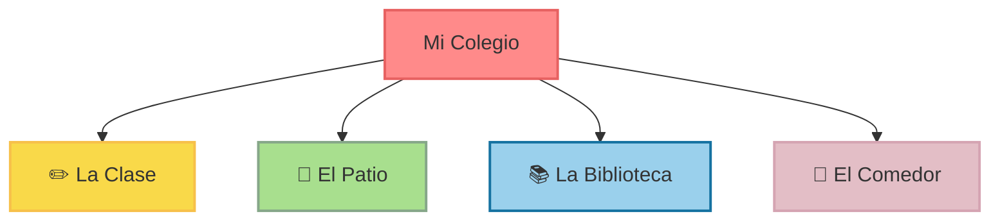

# ¡Bienvenidos a mi Colegio!

¡Hola, supergirasol! 🌻 Hoy empieza una aventura mágica. Acompaña a **Lucas** y a **Sofía** a explorar nuestro maravilloso colegio.

<svg viewBox="0 0 100 80" width="140" height="112" style={{display: 'block', margin: '20px auto', filter: 'drop-shadow(2px 4px 6px rgba(0,0,0,0.1))'}}>
  <rect x="10" y="30" width="80" height="50" rx="5" fill="#FF8A8A" />
  <polygon points="5,30 50,5 95,30" fill="#E76161" />
  <rect x="42" y="55" width="16" height="25" fill="#F9D949" />
  <circle cx="46" cy="67" r="1.5" fill="#3F2E3E" />
  <rect x="20" y="42" width="14" height="14" rx="2" fill="#F0F8FF" />
  <rect x="66" y="42" width="14" height="14" rx="2" fill="#F0F8FF" />
  <rect x="26" y="42" width="2" height="14" fill="#FF8A8A" />
  <rect x="72" y="42" width="2" height="14" fill="#FF8A8A" />
  <line x1="20" y1="49" x2="34" y2="49" stroke="#FF8A8A" strokeWidth="2" />
  <line x1="66" y1="49" x2="80" y2="49" stroke="#FF8A8A" strokeWidth="2" />
  <rect x="47" y="18" width="6" height="10" fill="#A8DF8E" />
  <polygon points="44,18 50,12 56,18" fill="#F3F8FF" />
</svg>

El colegio es como una **segunda casa** donde jugamos, reímos y aprendemos cosas increíbles todos los días.

---

## 🏫 ¿Qué lugares hay en mi Cole?

Nuestro colegio tiene zonas muy diferentes. ¡Cada una sirve para una cosa especial!

* **La Clase ✏️**: Es nuestro cuartel general. Aquí leemos, dibujamos y escuchamos a la maestra.
* **El Patio 🌳**: ¡El lugar de los juegos! Aquí corremos con la pelota y saltamos en el recreo.
* **La Biblioteca 📚**: Un rincón silencioso y lleno de cuentos fantásticos.
* **El Comedor 🍎**: Donde comemos cosas riquísimas para tener mucha energía.

Mira este mapa tan sencillo de nuestro cole:

---

## 🤝 ¿Quiénes nos ayudan en el Cole?

En el colegio nunca estamos solos. Hay un gran equipo de personas que nos cuidan con mucho amor:

1. **La Maestra o el Maestro**: Nos enseña a escribir, leer y pensar.
2. **Los Compañeros**: Son tus amigos de clase. ¡Jugamos juntos y compartimos los juguetes!
3. **El Conserje**: Abre las puertas y cuida de que todo funcione bien.
4. **La Cocinera**: Prepara la comida con mucho cariño.

:::tip ¿Sabías que...?
¡Saludar con una gran sonrisa por la mañana alegra el día a todos en el cole! 😊 ¡Pruébalo mañana!
:::

:::info ¡Tu turno!
Mira a tu alrededor. ¿Cuántas ventanas tiene tu clase? ¿De qué color es la mesa de tu maestra? ¡Cuéntaselo a tu compañero de mesa!
:::
