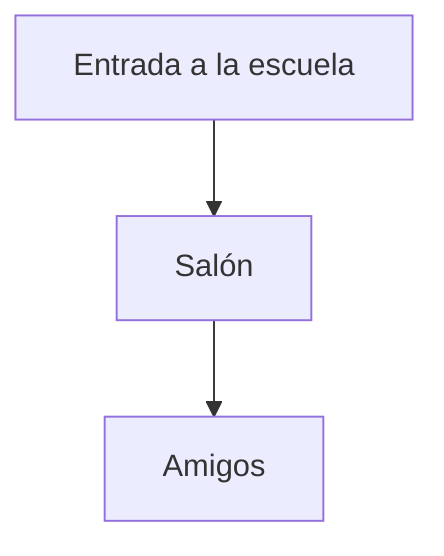

## ¡Aprendemos!

En esta unidad conoceremos la escuela, los amigos y el aula. ¿Qué cosas vemos al entrar?

- El salón de clases
- Los pupitres
- La pizarra

:::tip
Usa colores para dibujar tu aula.
:::

## ¡Practicamos!

**Reto inicial**: Dibuja un mapa de tu salón.

1. Dibuja una forma rectangular grande.
2. Dentro, dibuja pequeños rectángulos para los pupitres.
3. Añade tus compañeros con caritas.

## ¡Misión Cumplida!

**Situación de Aprendizaje**: Organiza una pequeña visita guiada de la escuela para tus padres, explicando cada espacio que has dibujado.

- Prepara una breve explicación de cada zona.
- Usa tus dibujos como apoyo visual.
