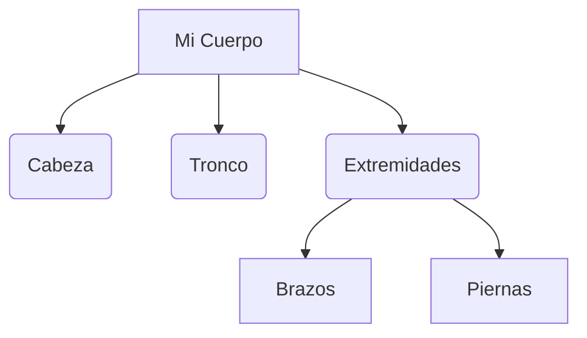

# ¡Mi Cuerpo es Genial!

Hoy vamos a descubrir cómo somos por fuera y qué partes tiene nuestro cuerpo.

## Las partes del cuerpo
Nuestro cuerpo tiene tres partes principales:

1. **La cabeza**: Donde está nuestra cara y nuestro cerebro.
2. **El tronco**: La parte central de nuestro cuerpo.
3. **Las extremidades**: Nuestros brazos y nuestras piernas.

:::tip ¡A moverse!
Gracias a nuestros huesos y músculos podemos saltar, correr y bailar.
:::

---
**Sugerencia de imagen**: Un dibujo infantil de un niño y una niña señalando las partes principales del cuerpo con etiquetas claras.
