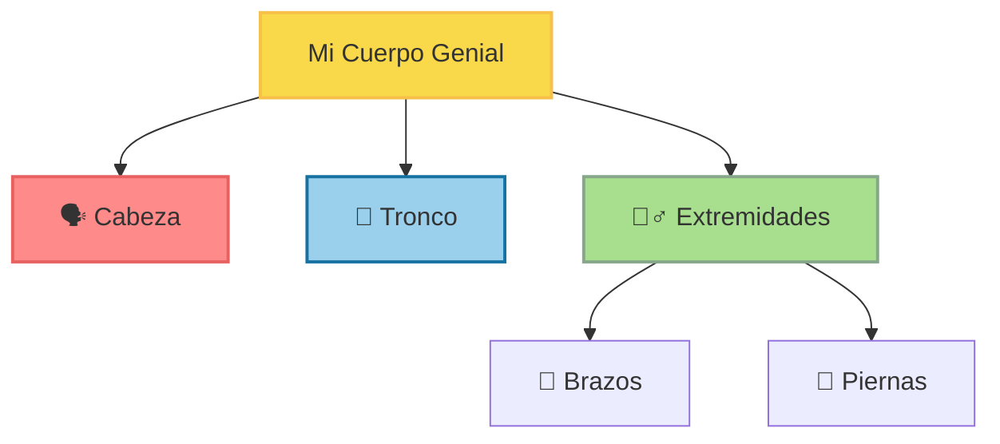

# ¡Mi Cuerpo es Genial!

¿Alguna vez te has parado a pensar en todo lo que puede hacer tu cuerpo? ¡Puedes saltar, cantar, correr y reír! Nuestro cuerpo es una máquina perfecta y hoy vamos a descubrir cómo funciona por fuera.

<svg viewBox="0 0 100 120" width="100" height="120" style={{display: 'block', margin: '20px auto', filter: 'drop-shadow(2px 3px 5px rgba(0,0,0,0.1))'}}>
  
  <circle cx="50" cy="25" r="12" fill="#F9D949" />
  
  <rect x="38" y="37" width="24" height="40" rx="3" fill="#FF8A8A" />
  
  <rect x="23" y="37" width="12" height="25" rx="3" fill="#9AD0EC" />
  <rect x="65" y="37" width="12" height="25" rx="3" fill="#9AD0EC" />
  
  <rect x="39" y="80" width="10" height="30" rx="3" fill="#A8DF8E" />
  <rect x="51" y="80" width="10" height="30" rx="3" fill="#A8DF8E" />
  
  <circle cx="46" cy="23" r="1.5" fill="#3F2E3E" />
  <circle cx="54" cy="23" r="1.5" fill="#3F2E3E" />
  <path d="M 46,29 Q 50,32 54,29" stroke="#3F2E3E" strokeWidth="1.5" fill="none" />
</svg>

---

## 🧍‍♀️ Las 3 Grandes Partes del Cuerpo

Si nos miramos en un espejo, podemos dividir nuestro cuerpo en tres partes principales:

1. **La Cabeza 🗣️**: Está arriba del todo. En ella tenemos la cara (ojos, nariz, boca y orejas) y por dentro está el cerebro, que se encarga de pensar y mandar órdenes.
2. **El Tronco 👕**: Es la parte central. Conecta todo. Dentro del tronco tenemos el corazón (que hace *tuc-tuc*) y los pulmones (para respirar el aire limpio).
3. **Las Extremidades 🏃‍♂️**: Son nuestros "brazos" (extremidades superiores) y nuestras "piernas" (extremidades inferiores). ¡Nos sirven para alcanzar cosas y correr súper rápido!

```mermaid
graph TD
    Cuerpo[Mi Cuerpo Genial] --> Cabeza[🗣️ Cabeza]
    Cuerpo --> Tronco[👕 Tronco]
    Cuerpo --> Extremidades[🏃‍♂️ Extremidades]
    Extremidades --> Brazos[💪 Brazos]
    Extremidades --> Piernas[🦵 Piernas]
    style Cuerpo fill:#F9D949,stroke:#F7C04A,stroke-width:2px;
    style Cabeza fill:#FF8A8A,stroke:#E76161,stroke-width:2px;
    style Tronco fill:#9AD0EC,stroke:#1572A1,stroke-width:2px;
    style Extremidades fill:#A8DF8E,stroke:#86A789,stroke-width:2px;
```

---

## 🦴 Las Articulaciones: ¡Nuestras Bisagras!

¿Te imaginas ser tan rígido como un muñeco de madera? 🤖 ¡No podríamos doblarnos! Gracias a las **articulaciones**, que son las uniones entre nuestros huesos, podemos doblar el cuerpo.

Las articulaciones más importantes son:
* **El Cuello**: Para girar la cabeza a los lados.
* **El Hombro y el Codo**: Para mover y doblar los brazos.
* **La Muñeca**: Para despedirnos con la mano.
* **La Cadera y la Rodilla**: Para agacharnos y dar patadas al balón.
* **El Tobillo**: Para girar el pie.

:::tip ¡Salud y Cuidado!
Para que nuestro cuerpo crezca fuerte y sano, debemos dormir 10 horas cada noche, comer muchas verduras y frutas, y jugar mucho al aire libre. 🍎🥦
:::

:::info ¡Prueba esto en clase!
Ponte de pie e intenta andar sin doblar las rodillas. ¿Es difícil, verdad? ¡Dales las gracias a tus articulaciones por existir! 😄
:::
