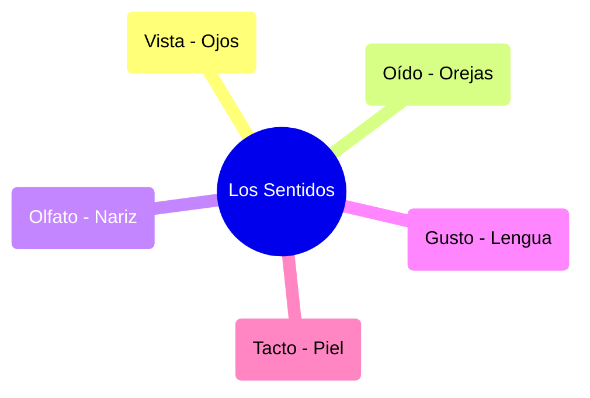

# ¡Cinco Ventanas al Mundo!

¿Sabes cómo podemos oler una flor o escuchar una canción? ¡Gracias a los sentidos!

## Los 5 Sentidos
Tenemos cinco sentidos que nos dan información de todo lo que nos rodea:

1. **La Vista**: Con los **ojos** vemos los colores y las formas.
2. **El Oído**: Con las **orejas** escuchamos sonidos y música.
3. **El Olfato**: Con la **nariz** olemos perfumes y también el chocolate.
4. **El Gusto**: Con la **lengua** sabemos si algo es dulce o salado.
5. **El Tacto**: Con la **piel** (sobre todo las manos) sentimos si algo está suave o pincha.

:::tip ¡Ojo al parche!
Debemos cuidar nuestros sentidos, por ejemplo, no mirando directamente al sol o no escuchando música muy fuerte.
:::

---
**Sugerencia de imagen**: Un esquema circular con iconos de un ojo, una oreja, una nariz, una boca y una mano, rodeados de colores vivos.
