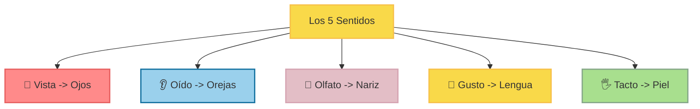

# ¡Los Cinco Sentidos!

¿Cómo sabemos si una flor es roja, si una campana suena fuerte o si una piruleta está dulce? 🍭 ¡Gracias a nuestros **cinco sentidos**! Ellos son como súper antenas que recogen información del mundo y la envían al cerebro.

<svg viewBox="0 0 100 80" width="120" height="96" style={{display: 'block', margin: '20px auto', filter: 'drop-shadow(2px 3px 4px rgba(0,0,0,0.1))'}}>
  
  <ellipse cx="25" cy="25" rx="12" ry="7" fill="#F3F8FF" stroke="#1572A1" strokeWidth="2.5" />
  <circle cx="25" cy="25" r="4.5" fill="#50A6FF" />
  <circle cx="25" cy="25" r="2" fill="#3F2E3E" />
  
  
  <path d="M 75,15 C 65,15 65,35 75,35 C 80,35 80,25 75,25" fill="none" stroke="#FF8A8A" strokeWidth="3" strokeLinecap="round" />
  
  
  <path d="M 20,60 Q 28,50 28,60 Q 28,65 24,65 Z" fill="#F9D949" stroke="#F7C04A" strokeWidth="2.5" />
  
  
  <rect x="68" y="58" width="14" height="14" rx="2" fill="#A8DF8E" />
  <path d="M 75,54 L 75,62 M 71,56 L 75,62 M 79,56 L 75,62" stroke="#86A789" strokeWidth="2" strokeLinecap="round" />
</svg>

---

## 👂 Los 5 Súper Sentidos y sus Órganos

Cada sentido tiene una parte de nuestro cuerpo especial que llamamos **órgano**:

1. **La Vista 👀**: Su órgano son los **ojos**. Nos sirve para ver los colores, las formas y el tamaño de las cosas.
2. **El Oído 👂**: Su órgano son las **orejas**. Nos sirve para escuchar música, el canto de los pájaros y el timbre del colegio.
3. **El Olfato 👃**: Su órgano es la **nariz**. Nos sirve para oler el perfume de las flores y... ¡la pizza recién hecha! 🍕
4. **El Gusto 👅**: Su órgano es la **lengua**. Nos sirve para saborear si la comida está dulce, salada, ácida o amarga.
5. **El Tacto 🖐️**: Su órgano es la **piel** (que cubre todo nuestro cuerpo, especialmente nuestras manos). Nos sirve para sentir si algo es suave como un peluche o áspero como una lija.

```mermaid
graph TD
    S[Los 5 Sentidos] --> Vista[👀 Vista -> Ojos]
    S --> Oido[👂 Oído -> Orejas]
    S --> Olfato[👃 Olfato -> Nariz]
    S --> Gusto[👅 Gusto -> Lengua]
    S --> Tacto[🖐️ Tacto -> Piel]
    style S fill:#F9D949,stroke:#F7C04A,stroke-width:2px;
    style Vista fill:#FF8A8A,stroke:#E76161,stroke-width:2px;
    style Oido fill:#9AD0EC,stroke:#1572A1,stroke-width:2px;
    style Olfato fill:#E3BEC6,stroke:#D5A4B2,stroke-width:2px;
    style Gusto fill:#F9D949,stroke:#F7C04A,stroke-width:2px;
    style Tacto fill:#A8DF8E,stroke:#86A789,stroke-width:2px;
```

---

## 🛡️ Cuidamos de nuestros Sentidos

Nuestros sentidos son muy valiosos. Por eso debemos cuidarlos:
* **Para los ojos:** No mirar directamente al sol y leer con buena luz. ☀️
* **Para los oídos:** No usar auriculares con música muy fuerte. 🎧
* **Para la piel:** Usar crema solar cuando vayamos a la playa. 🏖️
* **Para la boca y nariz:** Lavarnos bien los dientes y no meternos cosas en la nariz. 🪥

:::tip ¡Sabías que...!
Los perros tienen el sentido del olfato muchísimo más desarrollado que nosotros. ¡Pueden oler cosas que nosotros ni imaginamos! 🐶
:::
