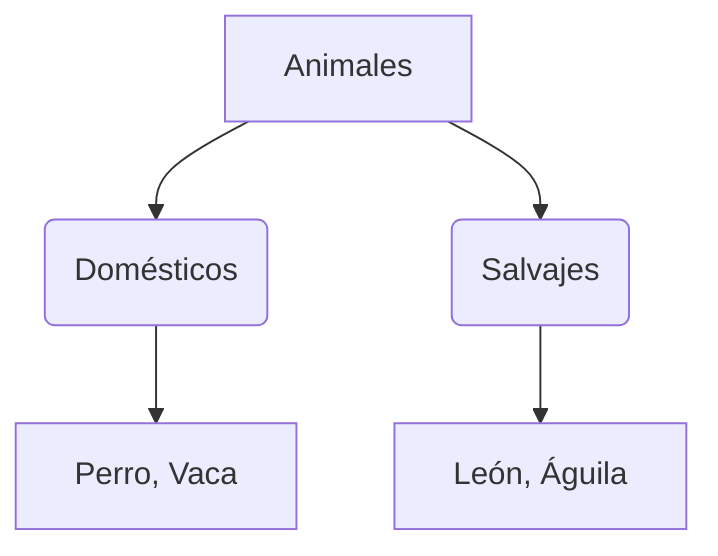

# ¡Nuestros Amigos los Animales!

¡Hola! Hoy vamos a viajar por la naturaleza para conocer a los animales.

## ¿Cómo son los animales?
Hay muchísimos animales diferentes. Podemos dividirlos en dos grupos según si viven con nosotros o en libertad:

1. **Animales Domésticos**: Viven cerca de las personas, como el perro, el gato o la vaca. ¡Nos ayudan y nos dan cariño!
2. **Animales Salvajes**: Viven libres en la naturaleza, como el león, el elefante o el lobo.

### ¿Qué comen?
- **Herbívoros**: Comen hierba y plantas (como el conejo).
- **Carnívoros**: Comen carne de otros animales (como el tigre).
- **Omnívoros**: Comen de todo (como el oso o nosotros).

:::tip ¡Cuidamos la naturaleza!
Todos los animales son importantes para el planeta. Debemos respetar su hogar.
:::

---
**Sugerencia de imagen**: Una ilustración de una granja con animales domésticos y una selva al fondo con animales salvajes.
