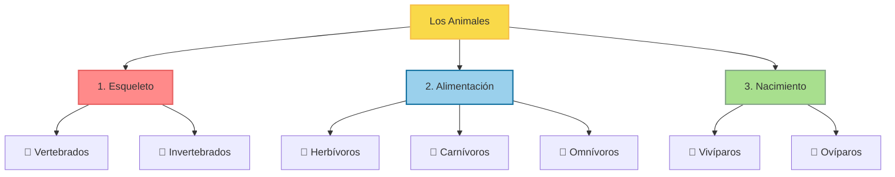

# ¡El Reino de los Animales!

¡Hola, explorador de la selva! 🦁 En nuestro planeta viven millones de criaturas fascinantes. Los animales son **seres vivos** porque nacen, crecen, se alimentan, se relacionan, se reproducen y mueren. ¡Hoy vamos a aprender a clasificarlos de formas muy divertidas!

<svg viewBox="0 0 100 80" width="120" height="96" style={{display: 'block', margin: '20px auto', filter: 'drop-shadow(2px 3px 5px rgba(0,0,0,0.1))'}}>
  
  
  <ellipse cx="45" cy="55" rx="16" ry="12" fill="#E3BEC6" />
  
  <circle cx="60" cy="42" r="10" fill="#E3BEC6" />
  
  <circle cx="28" cy="55" r="4" fill="#F3F8FF" />
  
  <ellipse cx="56" cy="24" rx="4" ry="10" fill="#E3BEC6" transform="rotate(-10 56 24)" />
  <ellipse cx="62" cy="24" rx="3.5" ry="9.5" fill="#FF8A8A" transform="rotate(5 62 24)" />
  
  <circle cx="63" cy="40" r="1.5" fill="#3F2E3E" />
  
  <circle cx="68" cy="44" r="1" fill="#FF8A8A" />
  
  <rect x="10" y="65" width="80" height="5" rx="2" fill="#A8DF8E" />
</svg>

---

## 🦴 1. Según su esqueleto: ¿Tienen huesos?

* **Vertebrados 🐶**: Tienen huesos y columna vertebral por dentro. Son fuertes y su cuerpo se sostiene bien.
  * *Ejemplos:* Un perro, un pájaro, un pez, una rana o tú mismo.
* **Invertebrados 🦋**: No tienen huesos ni columna vertebral. Muchos son blanditos y pequeños.
  * *Ejemplos:* Una mariposa, un caracol, una araña o una medusa.

---

## 🍎 2. Según lo que comen: ¿Qué hay para almorzar?

* **Herbívoros 🐰**: Solo comen plantas, hierba, hojas o frutos.
  * *Ejemplos:* La jirafa, el conejo y la vaca.
* **Carnívoros 🐯**: Se alimentan de la carne de otros animales.
  * *Ejemplos:* El león, el lobo y el águila.
* **Omnívoros 🐻**: ¡Comen de todo! Tanto plantas como carne de otros animales.
  * *Ejemplos:* El oso, el cerdo y las personas.

---

## 🥚 3. Según cómo nacen: ¿De dónde vienen?

* **Vivíparos 🍼**: Nacen del vientre de su mamá. Al nacer, beben leche de su mamá.
  * *Ejemplos:* Los gatos, los perros y los delfines.
* **Ovíparos 🥚**: Nacen dentro de un huevo que pone su mamá y cuida en un nido.
  * *Ejemplos:* Las gallinas, los patos, los cocodrilos y los peces.

```mermaid
graph TD
    Animales[Los Animales] --> Huesos[1. Esqueleto]
    Animales --> Comida[2. Alimentación]
    Animales --> Nace[3. Nacimiento]
    
    Huesos --> Vertebrados[🐶 Vertebrados]
    Huesos --> Invertebrados[🦋 Invertebrados]
    
    Comida --> Herbivoros[🐰 Herbívoros]
    Comida --> Carnivoros[🐯 Carnívoros]
    Comida --> Omnivoros[🐻 Omnívoros]
    
    Nace --> Viviparos[🍼 Vivíparos]
    Nace --> Oviparos[🥚 Ovíparos]
    
    style Animales fill:#F9D949,stroke:#F7C04A,stroke-width:2px;
    style Huesos fill:#FF8A8A,stroke:#E76161,stroke-width:2px;
    style Comida fill:#9AD0EC,stroke:#1572A1,stroke-width:2px;
    style Nace fill:#A8DF8E,stroke:#86A789,stroke-width:2px;
```

---

:::tip ¡Ojo al dato!
El animal vertebrado más grande del mundo vive en el agua: ¡la ballena azul! Y no pone huevos, ¡es vivípara! 🐳
:::
