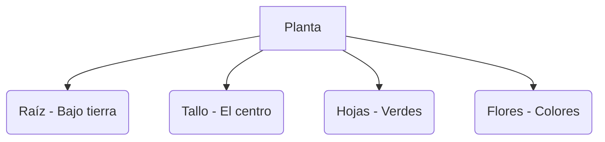

# ¡El Mundo Verde de las Plantas!

Las plantas son seres vivos que nacen, crecen y nos dan oxígeno para respirar.

## Las partes de una planta
Casi todas las plantas tienen estas partes:

1. **La Raíz**: Está debajo de la tierra. Sujeta la planta y busca agua.
2. **El Tallo**: Sujeta las hojas y las flores. Es como el cuerpo de la planta.
3. **Las Hojas**: Son de color verde y ayudan a la planta a respirar.
4. **Las Flores**: Son preciosas y de muchos colores. ¡De aquí salen las semillas!

### ¿Qué necesitan para vivir?
Para estar fuertes y sanas, las plantas necesitan:
- **Agua** (pero sin pasarse).
- **Luz del Sol**.
- **Tierra** con alimento.
- **Aire** limpio.

:::tip ¡Sabías que...!
¡Hay plantas que podemos comer! Como las lechugas (hojas), las zanahorias (raíces) o las manzanas (frutos).
:::

---
**Sugerencia de imagen**: Un dibujo de una flor con flechas señalando cada parte (raíz, tallo, hoja, flor) y sol y lluvia cayendo sobre ella.
