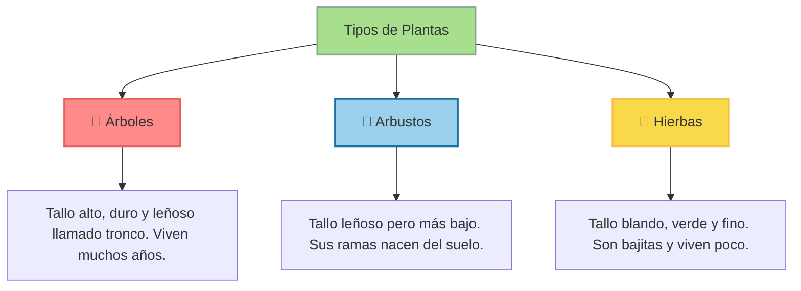

# ¡Las Plantas son Vida!

¡Hola, jardinero del saber! 🌻 Hoy vamos a explorar unas vecinas muy especiales que no hablan ni caminan, pero están llenas de vida: **las plantas**. Ellas purifican el aire que respiramos y llenan de color nuestro planeta.

<svg viewBox="0 0 100 120" width="100" height="120" style={{display: 'block', margin: '20px auto', filter: 'drop-shadow(2px 3px 5px rgba(0,0,0,0.1))'}}>
  
  <rect x="5" y="100" width="90" height="15" rx="3" fill="#B08A55" />
  
  
  <path d="M 50,100 Q 45,112 40,115 M 50,100 Q 55,110 60,114 M 50,100 L 50,118" stroke="#8A6E45" strokeWidth="2.5" fill="none" />
  
  
  <path d="M 50,60 L 50,100" stroke="#86A789" strokeWidth="5" fill="none" />
  
  
  <path d="M 50,80 Q 30,75 35,70 Q 42,70 50,80" fill="#A8DF8E" />
  <path d="M 50,70 Q 70,65 65,60 Q 58,60 50,70" fill="#A8DF8E" />
  
  
  <circle cx="50" cy="40" r="14" fill="#FF8A8A" />
  <circle cx="38" cy="40" r="8" fill="#F9D949" />
  <circle cx="62" cy="40" r="8" fill="#F9D949" />
  <circle cx="50" cy="28" r="8" fill="#F9D949" />
  <circle cx="50" cy="52" r="8" fill="#F9D949" />
  
  <circle cx="50" cy="40" r="7" fill="#F3F8FF" />
</svg>

---

## 🌻 1. Las Partes de una Planta

Al igual que nosotros tenemos cabeza y piernas, las plantas tienen sus propias partes:

1. **La Raíz 🪱**: Está escondida debajo de la tierra. Sujeta la planta al suelo y absorbe el agua y el alimento.
2. **El Tallo 🎋**: Es la columna de la planta. Sostiene las hojas y transporta el agua hacia arriba.
3. **Las Hojas 🍃**: Nacen en el tallo. Son las "ventanas" por donde la planta respira y recibe la luz del sol.
4. **La Flor y el Fruto 🍎**: Algunas plantas tienen flores preciosas que luego se convierten en ricos frutos llenos de semillas.

---

## ☀️ 2. ¿Qué necesita una Planta para Vivir?

Las plantas son muy buenas y agradecidas, pero para crecer sanas necesitan cuatro amigos:

* **Tierra (Suelo) 🟫**: De donde toman el alimento.
* **Agua 💧**: Para calmar su sed.
* **Luz del Sol ☀️**: Para fabricar su propio alimento.
* **Aire 💨**: Para respirar tranquilas.

---

## 🌳 3. Tipos de Plantas según su Tallo

Podemos clasificar las plantas en tres grupos:

```mermaid
graph TD
    Plantas[Tipos de Plantas] --> Arboles[🌳 Árboles]
    Plantas --> Arbustos[🌿 Arbustos]
    Plantas --> Hierbas[🌱 Hierbas]
    
    Arboles --> T1[Tallo alto, duro y leñoso llamado tronco. Viven muchos años.]
    Arbustos --> T2[Tallo leñoso pero más bajo. Sus ramas nacen del suelo.]
    Hierbas --> T3[Tallo blando, verde y fino. Son bajitas y viven poco.]
    
    style Plantas fill:#A8DF8E,stroke:#86A789,stroke-width:2px;
    style Arboles fill:#FF8A8A,stroke:#E76161,stroke-width:2px;
    style Arbustos fill:#9AD0EC,stroke:#1572A1,stroke-width:2px;
    style Hierbas fill:#F9D949,stroke:#F7C04A,stroke-width:2px;
```

---

:::tip ¡Sabías que...!
Las plantas fabrican su propio oxígeno por el día. ¡Gracias a los árboles de los bosques podemos respirar aire limpio! Cuida siempre de las plantas y no arranques sus hojas. 🌲✨
:::
