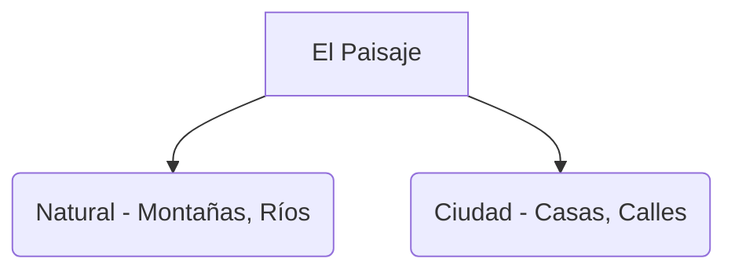

# ¡Miramos por la Ventana!

Cuando miramos a nuestro alrededor, vemos paisajes. ¡Hay paisajes de muchos tipos!

## Paisajes Naturales y de Ciudad
Podemos encontrar dos grandes grupos de paisajes:

1. **Paisajes Naturales**: Son los que no han sido cambiados por las personas. Tienen montañas, ríos, bosques y muchos animales.
2. **Paisajes de Ciudad**: Son los que las personas han construido. Tienen casas, carreteras, puentes y parques.

### ¿Qué hay en mi paisaje?
- **Relieve**: Montañas (altas) y llanuras (planas).
- **Agua**: Ríos, lagos y el mar.
- **Vegetación**: Árboles, flores y hierba.

:::tip ¡Cuidamos Extremadura!
En nuestra comunidad tenemos paisajes naturales preciosos como la Dehesa. ¡Debemos mantenerlos limpios sin tirar basura!
:::

---
**Sugerencia de imagen**: Un dibujo dividido en dos: a la izquierda una montaña con un río y a la derecha una calle con edificios y un coche.
