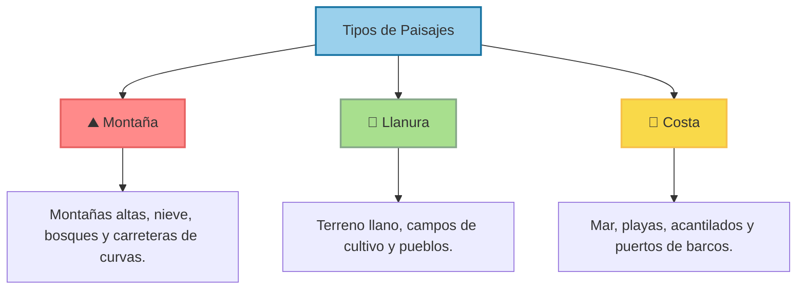

# ¡Los Bellos Paisajes!

¿Qué ves cuando miras por la ventana del coche cuando vas de viaje? 🚗 ¡Ves un **paisaje**! Un paisaje es todo lo que alcanzamos a ver a nuestro alrededor. Hay paisajes llenos de montañas gigantes y otros planos con playas de arena dorada.

<svg viewBox="0 0 100 80" width="120" height="96" style={{display: 'block', margin: '20px auto', filter: 'drop-shadow(2px 3px 5px rgba(0,0,0,0.1))'}}>
  
  <rect x="5" y="5" width="90" height="70" rx="4" fill="#F3F8FF" />
  
  
  <polygon points="5,50 35,20 65,50" fill="#9AD0EC" />
  <polygon points="40,55 65,30 90,55" fill="#1572A1" opacity="0.8" />
  <polygon points="30,25 35,20 40,25" fill="#F3F8FF" />
  <polygon points="60,35 65,30 70,35" fill="#F3F8FF" />
  
  
  <path d="M 50,50 Q 55,60 45,65 Q 40,70 48,75" fill="none" stroke="#50A6FF" strokeWidth="4" strokeLinecap="round" />
  
  
  <rect x="65" y="52" width="16" height="16" rx="1" fill="#FF8A8A" />
  <polygon points="62,52 73,43 84,52" fill="#E76161" />
  <rect x="71" y="60" width="4" height="8" fill="#F9D949" />
</svg>

---

## 🧱 1. Elementos de un Paisaje

En cualquier paisaje del mundo podemos encontrar dos tipos de elementos:

* **Elementos Naturales 🌳 (Naturaleza)**: Son aquellos que no han sido creados por las personas. ¡Estaban ahí desde siempre!
  * *Ejemplos:* Montañas, ríos, árboles, rocas, nubes y animales.
* **Elementos Humanizados o Artificiales 🏠 (Hechos por el hombre)**: Son las cosas construidas o modificadas por los seres humanos para poder vivir mejor.
  * *Ejemplos:* Casas, carreteras, puentes, vías del tren y faros.

---

## ⛰️ 2. Tipos de Paisajes

Dependiendo de dónde nos encontremos, los paisajes cambian mucho:

1. **Paisaje de Montaña ⛰️**: Tiene montañas muy altas con cumbres de nieve. Las carreteras tienen muchas curvas. El clima suele ser frío.
2. **Paisaje de Llanura 🌾**: Es un terreno plano y llano, sin apenas cuestas. Hay muchos campos de cultivo (como trigo o maíz) y pueblos grandes.
3. **Paisaje de Costa 🌊**: Es el paisaje que está al lado del mar. En él hay playas de arena, acantilados de roca dura, puertos y faros.

```mermaid
graph TD
    Paisajes[Tipos de Paisajes] --> Montaña[⛰️ Montaña]
    Paisajes --> Llanura[🌾 Llanura]
    Paisajes --> Costa[🌊 Costa]
    
    Montaña --> M1[Montañas altas, nieve, bosques y carreteras de curvas.]
    Llanura --> L1[Terreno llano, campos de cultivo y pueblos.]
    Costa --> C1[Mar, playas, acantilados y puertos de barcos.]
    
    style Paisajes fill:#9AD0EC,stroke:#1572A1,stroke-width:2px;
    style Montaña fill:#FF8A8A,stroke:#E76161,stroke-width:2px;
    style Llanura fill:#A8DF8E,stroke:#86A789,stroke-width:2px;
    style Costa fill:#F9D949,stroke:#F7C04A,stroke-width:2px;
```

---

:::tip ¡Sabías que...!
El paisaje natural de nuestra comunidad autónoma, **Extremadura**, destaca por sus hermosas **dehesas**: paisajes de llanuras y colinas suaves llenas de encinas y alcornoques donde pastan felices las ovejas y los cerdos ibéricos. 🌳🐖
:::
