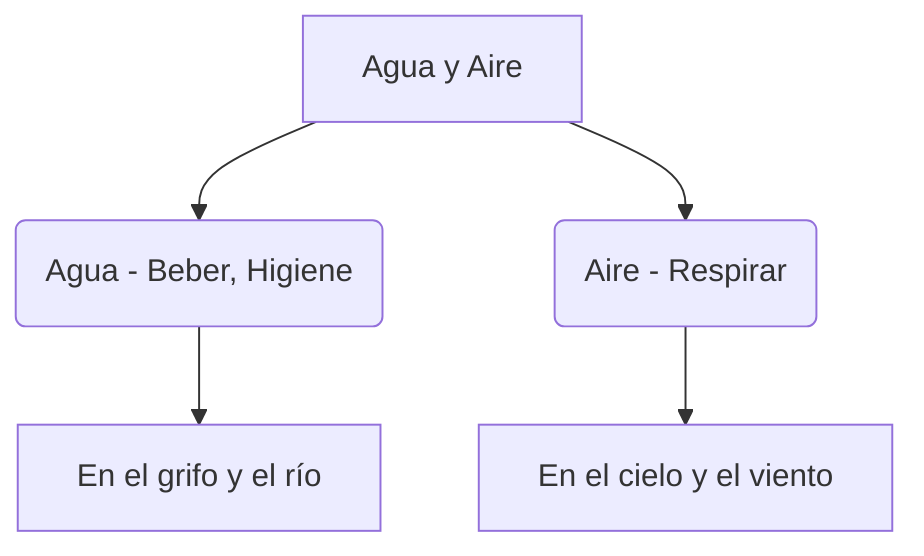

# ¡Agua para Beber, Aire para Respirar!

El agua y el aire son necesarios para que todos los seres vivos podamos vivir. ¡Sin ellos no habría vida!

## El Agua
El agua es un tesoro. La encontramos en:
- **La naturaleza**: Mares, ríos, lagos y también en la nieve y la lluvia.
- **Nuestras casas**: En el grifo, la ducha o la cocina.

### ¿Cómo es el agua?
- No tiene color (**incolora**).
- No tiene olor (**inodora**).
- No tiene sabor (**insípida**).

## El Aire
El aire está en todas partes, aunque no lo veamos. ¡Lo necesitamos para respirar!

:::tip ¡Ahorramos agua!
Cierra el grifo mientras te lavas los dientes. ¡Cada gota cuenta!
:::

---
**Sugerencia de imagen**: Un dibujo de una gota de agua sonriente y una nube soplando suavemente, rodeados de flores y niños.
