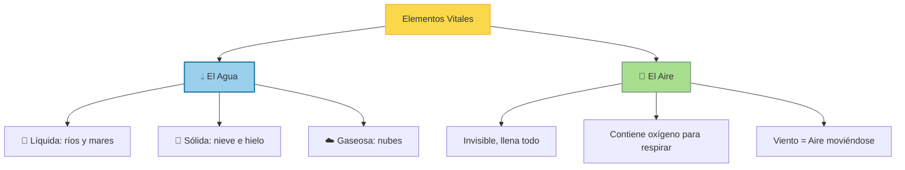

# ¡El Agua y el Aire!

¡Hola, guardián de la Tierra! 🌍 Hoy vamos a conocer a dos mejores amigos invisibles y mágicos que hacen posible que haya vida en nuestro planeta: **el agua** y **el aire**. Sin ellos, la Tierra sería un desierto sin plantas ni animales.

<svg viewBox="0 0 100 80" width="120" height="96" style={{display: 'block', margin: '20px auto', filter: 'drop-shadow(2px 3px 5px rgba(0,0,0,0.1))'}}>
  
  <path d="M 30,45 Q 20,45 23,35 Q 23,20 38,22 Q 45,10 60,15 Q 73,15 73,28 Q 80,33 73,45 Z" fill="#9AD0EC" />
  
  <path d="M 35,55 L 35,62 M 33,57 L 35,62 L 37,57" stroke="#50A6FF" strokeWidth="2.5" strokeLinecap="round" fill="none" />
  <path d="M 50,58 L 50,65 M 48,60 L 50,65 L 52,60" stroke="#50A6FF" strokeWidth="2.5" strokeLinecap="round" fill="none" />
  <path d="M 65,55 L 65,62 M 63,57 L 65,62 L 67,57" stroke="#50A6FF" strokeWidth="2.5" strokeLinecap="round" fill="none" />
  
  <path d="M 10,25 Q 15,22 20,25 M 5,35 Q 12,30 18,35" fill="none" stroke="#FFFFFF" strokeWidth="2" strokeLinecap="round" />
</svg>

---

## 💧 1. El Agua: ¡Nuestra fuente de vida!

El agua es un líquido maravilloso. No tiene color (es **transparente**), no tiene sabor (es **insípida**) y no tiene olor (es **inodora**).

Podemos encontrar el agua de tres formas o estados en la naturaleza:
* **Líquida 🥛**: En los ríos, los lagos, el mar y cuando sale del grifo.
* **Sólida (Hielo) 🧊**: En la nieve de las montañas, en el granizo y en los cubitos de hielo del congelador.
* **Gaseosa (Vapor) ☁️**: Cuando el agua se calienta y sube al cielo para formar las nubes.

---

## 💨 2. El Aire y el Viento

El aire está por todas partes, aunque no podamos verlo ni cogerlo con las manos.
* **¿Qué es el aire?**: Es una mezcla de gases invisible que cubre la Tierra. Contiene el **oxígeno** que respiramos.
* **¿Qué es el viento?**: ¡Es el aire en movimiento! Podemos sentirlo en la cara cuando sopla o ver cómo mueve las hojas de los árboles. 🍃

```mermaid
graph TD
    Tierra[Elementos Vitales] --> Agua[💧 El Agua]
    Tierra --> Aire[💨 El Aire]
    
    Agua --> Est1[🥛 Líquida: ríos y mares]
    Agua --> Est2[🧊 Sólida: nieve e hielo]
    Agua --> Est3[☁️ Gaseosa: nubes]
    
    Aire --> A1[Invisible, llena todo]
    Aire --> A2[Contiene oxígeno para respirar]
    Aire --> A3[Viento = Aire moviéndose]
    
    style Tierra fill:#F9D949,stroke:#F7C04A,stroke-width:2px;
    style Agua fill:#9AD0EC,stroke:#1572A1,stroke-width:2px;
    style Aire fill:#A8DF8E,stroke:#86A789,stroke-width:2px;
```

---

:::tip ¡Ojo al dato!
La mayor parte del agua de la Tierra es **salada** (la de los mares y océanos) y no podemos beberla. El agua dulce que bebemos procede de la lluvia y los ríos, y es muy escasa. ¡Por eso debemos cerrarlo bien y no desperdiciar ni una gota! 🚿🧼
:::
