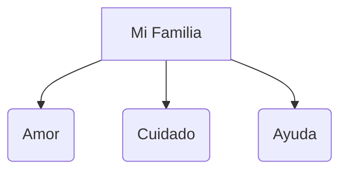

# ¡Mi Familia es Especial!

La familia son las personas que nos quieren y nos cuidan. ¡Todas las familias son diferentes y únicas!

## Los tipos de familia
Hay familias grandes, familias pequeñas, con abuelos, con tíos... ¡Lo más importante es el amor!

## Mi Casa
Nuestra casa es el lugar donde vivimos protegidos. Tiene diferentes partes:
- **La Cocina**: Donde preparamos la comida.
- **El Salón**: Donde descansamos y estamos juntos.
- **El Dormitorio**: Donde dormimos y jugamos.
- **El Baño**: Donde nos aseamos.

:::tip ¡Ayudamos en casa!
Todos podemos ayudar un poquito: recogiendo los juguetes, poniendo la mesa o haciendo la cama. ¡En equipo es mejor!
:::

---
**Sugerencia de imagen**: Un dibujo de una casa con el tejado rojo y diferentes tipos de familias (diversidad) saludando desde las ventanas.
