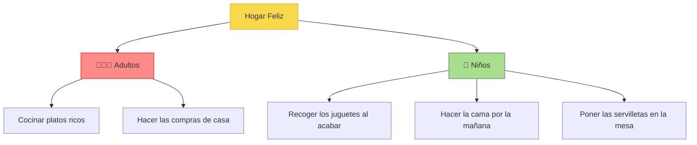

# ¡Mi Familia y mi Casa!

¡Hola, amigo! 🏠 Hoy vamos a hablar de dos cosas súper importantes que nos dan calor, seguridad y mucho amor: **nuestra familia** y **nuestra casa**. Aunque todas las familias y las casas del mundo son diferentes, todas tienen algo en común: ¡son refugios de felicidad!

<svg viewBox="0 0 100 80" width="120" height="96" style={{display: 'block', margin: '20px auto', filter: 'drop-shadow(2px 3px 5px rgba(0,0,0,0.1))'}}>
  
  <rect x="15" y="30" width="70" height="40" rx="3" fill="#F9D949" stroke="#F7C04A" strokeWidth="2.5" />
  <polygon points="10,30 50,5 90,30" fill="#E76161" />
  
  <rect x="42" y="48" width="16" height="22" fill="#B08A55" />
  <circle cx="46" cy="59" r="1.5" fill="#3F2E3E" />
  
  <rect x="25" y="38" width="12" height="12" rx="2" fill="#F3F8FF" stroke="#1572A1" strokeWidth="1.5" />
  <rect x="63" y="38" width="12" height="12" rx="2" fill="#F3F8FF" stroke="#1572A1" strokeWidth="1.5" />
</svg>

---

## 👨‍👩‍👧‍👦 1. ¿Qué es una Familia?

Una familia es un grupo de personas que se quieren, se apoyan y se cuidan mutuamente. ¡Hay familias de muchos tipos!
* **Grandes**: Con muchos hermanos, abuelos y tíos viviendo cerca.
* **Pequeñas**: Papá o mamá y un hijo.
* **Diversas**: Con dos papás, dos mamás o tutores cariñosos.
* **¡Todas son fantásticas!** Lo más valioso de una familia no es el número de personas, sino el **amor y el respeto** que comparten.

---

## 🛋️ 2. Las Estancias de nuestra Casa

Nuestra casa es el lugar donde vivimos protegidos de la lluvia y el frío. Dentro de ella hay diferentes habitaciones o estancias:

1. **El Salón 📺**: Donde nos reunimos a charlar, leer o ver la televisión juntos.
2. **La Cocina 🍳**: El lugar donde se cocinan los alimentos ricos y saludables.
3. **El Dormitorio 🛏️**: Nuestra habitación personal para dormir y guardar nuestros juguetes.
4. **El Baño 🛁**: Donde nos aseamos, nos duchamos y nos lavamos los dientes.

---

## 🧹 3. La Tarea de Todos: ¡Colaborar en Casa!

Una casa limpia y ordenada es un lugar feliz. Mantenerla limpia no es tarea de una sola persona; ¡es un trabajo de **toda la familia**! 

Mira este mapa de cómo podemos colaborar todos:

```mermaid
graph TD
    Casa[Hogar Feliz] --> Adultos[👨‍👩‍👦 Adultos]
    Casa --> Niños[🎒 Niños]
    
    Adultos --> A1[Cocinar platos ricos]
    Adultos --> A2[Hacer las compras de casa]
    
    Niños --> N1[Recoger los juguetes al acabar]
    Niños --> N2[Hacer la cama por la mañana]
    Niños --> N3[Poner las servilletas en la mesa]
    
    style Casa fill:#F9D949,stroke:#F7C04A,stroke-width:2px;
    style Adultos fill:#FF8A8A,stroke:#E76161,stroke-width:2px;
    style Niños fill:#A8DF8E,stroke:#86A789,stroke-width:2px;
```

---

:::tip ¡Ojo!
Dar las gracias cuando nos preparan la cena y pedir las cosas con un **"por favor"** son las llaves mágicas que hacen que convivir en casa sea maravilloso. ✨
:::
