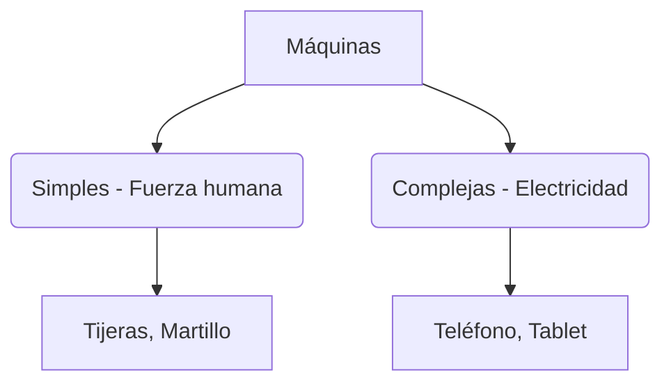

# ¡Máquinas que nos Ayudan!

Las máquinas son objetos que inventamos las personas para hacer las cosas más fáciles y rápido. ¡Están por todas partes!

## ¿Qué tipos de máquinas hay?
Podemos encontrar máquinas muy diferentes:

1. **Máquinas Simples**: Tienen pocas piezas y funcionan con nuestra fuerza, como una **rueda**, una **rampa** o unas **tijeras**.
2. **Máquinas Complejas**: Tienen muchas piezas y funcionan con electricidad o pilas, como un **ordenador**, una **lavadora** o un **coche**.

### ¿Para qué sirven?
- **Para viajar**: Aviones, trenes, bicicletas.
- **Para limpiar**: Aspiradoras, lavadoras.
- **Para comunicarnos**: Teléfonos, ordenadores.
- **Para trabajar**: Grúas, tractores.

:::tip ¡Cuidado con las máquinas!
Las máquinas nos ayudan mucho, pero siempre debemos usarlas con cuidado y con ayuda de un adulto.
:::

---
**Sugerencia de imagen**: Un dibujo de un niño usando una bicicleta (máquina simple) y una niña usando una tablet (máquina compleja).
