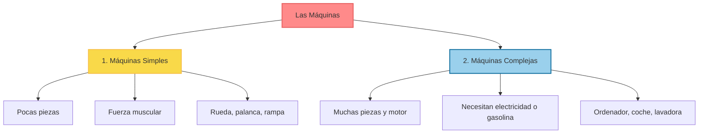

# ¡Las Máquinas y los Inventos!

¡Hola, inventor del futuro! 🚀 Hoy vamos a adentrarnos en un mundo lleno de engranajes, ruedas y tecnología: **las máquinas**. Las máquinas son ingenios creados por los seres humanos para hacer trabajos con menos esfuerzo, ahorrar tiempo y comunicarnos mejor.

<svg viewBox="0 0 100 80" width="120" height="96" style={{display: 'block', margin: '20px auto', filter: 'drop-shadow(2px 3px 5px rgba(0,0,0,0.1))'}}>
  
  
  <circle cx="40" cy="40" r="16" fill="none" stroke="#F9D949" strokeWidth="6" strokeDasharray="10 6" />
  <circle cx="40" cy="40" r="12" fill="#F9D949" />
  <circle cx="40" cy="40" r="4" fill="#F3F8FF" />
  
  
  <circle cx="68" cy="48" r="12" fill="none" stroke="#FF8A8A" strokeWidth="4.5" strokeDasharray="8 5" />
  <circle cx="68" cy="48" r="9" fill="#FF8A8A" />
  <circle cx="68" cy="48" r="3" fill="#F3F8FF" />
</svg>

---

## ⚙️ 1. ¿Qué es una Máquina?

Cualquier aparato que te ayude en tu día a día es una máquina. ¡Hay dos grandes familias de máquinas!

* **Máquinas Simples 🚲 (Fáciles)**: Tienen muy pocas piezas y funcionan con la fuerza de nuestros músculos.
  * **La Rueda 🛞**: Para mover cosas pesadas arrastrándolas fácilmente.
  * **La Palanca ⚖️**: Como un balancín del parque, nos ayuda a levantar pesos grandes.
  * **La Rampa (Plano inclinado) 🛹**: Para subir o bajar objetos empujándolos por una cuesta.
* **Máquinas Complejas ⚡ (Aparatos modernos)**: Tienen muchas piezas y engranajes por dentro. Necesitan electricidad, pilas o motores de gasolina para funcionar.
  * *Ejemplos:* Un ordenador, un coche, una lavadora, un teléfono móvil o la televisión.

---

## 🔌 2. ¡Seguridad con las Máquinas!

Las máquinas eléctricas nos ayudan mucho, pero hay que tratarlas con mucho respeto para no hacernos daño:

* **¡Nunca toques los enchufes con las manos mojadas!** 💦⚡
* **¡Pide ayuda siempre a un adulto** si tienes que usar un cuchillo, unas tijeras grandes o la batidora! 👩‍🍳
* **¡No estés demasiado tiempo delante de las pantallas!** (televisión, móvil, tablet). Tus ojos necesitan descansar y jugar al aire libre. 🌳⚽

```mermaid
graph TD
    Maquinas[Las Máquinas] --> Simples[1. Máquinas Simples]
    Maquinas --> Complejas[2. Máquinas Complejas]
    
    Simples --> S1[Pocas piezas]
    Simples --> S2[Fuerza muscular]
    Simples --> S3[Rueda, palanca, rampa]
    
    Complejas --> C1[Muchas piezas y motor]
    Complejas --> C2[Necesitan electricidad o gasolina]
    Complejas --> C3[Ordenador, coche, lavadora]
    
    style Maquinas fill:#FF8A8A,stroke:#E76161,stroke-width:2px;
    style Simples fill:#F9D949,stroke:#F7C04A,stroke-width:2px;
    style Complejas fill:#9AD0EC,stroke:#1572A1,stroke-width:2px;
```

---

:::tip ¡Sabías que...!
La **rueda** es considerada uno de los inventos más importantes de toda la historia de la humanidad. Se inventó hace miles de años y hoy en día casi todas las máquinas complejas de transporte la utilizan. 🛞🚕
:::
