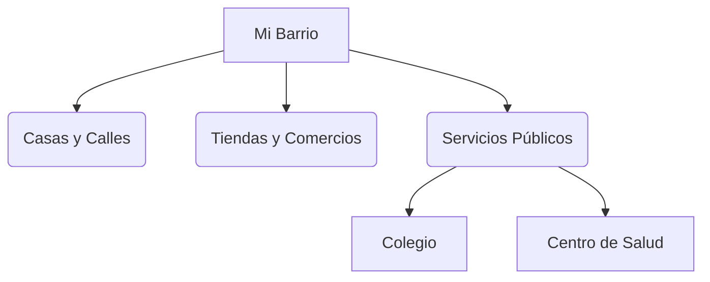

# ¡Bienvenidos a mi Barrio!

¿Te has fijado en las calles por las que caminas para venir al cole? ¡Todo eso forma parte de tu barrio!

## ¿Qué es un barrio?
Un barrio es una parte de una ciudad o un pueblo. En él hay casas, tiendas, parques y servicios que usamos todos los días.

### Lugares de mi barrio
En casi todos los barrios podemos encontrar:
- **Comercios**: Panaderías, fruterías o supermercados donde compramos lo que necesitamos.
- **Servicios Públicos**: El centro de salud, el colegio, la biblioteca o la oficina de correos.
- **Zonas de Ocio**: Parques, plazas y polideportivos para jugar.

:::tip ¡Somos buenos vecinos!
Cuidar el barrio es tarea de todos: tira la basura a la papelera y respeta el mobiliario urbano.
:::

---
**Sugerencia de imagen**: Una ilustración colorida de una calle con una panadería, un parque con niños jugando y un colegio al fondo.
