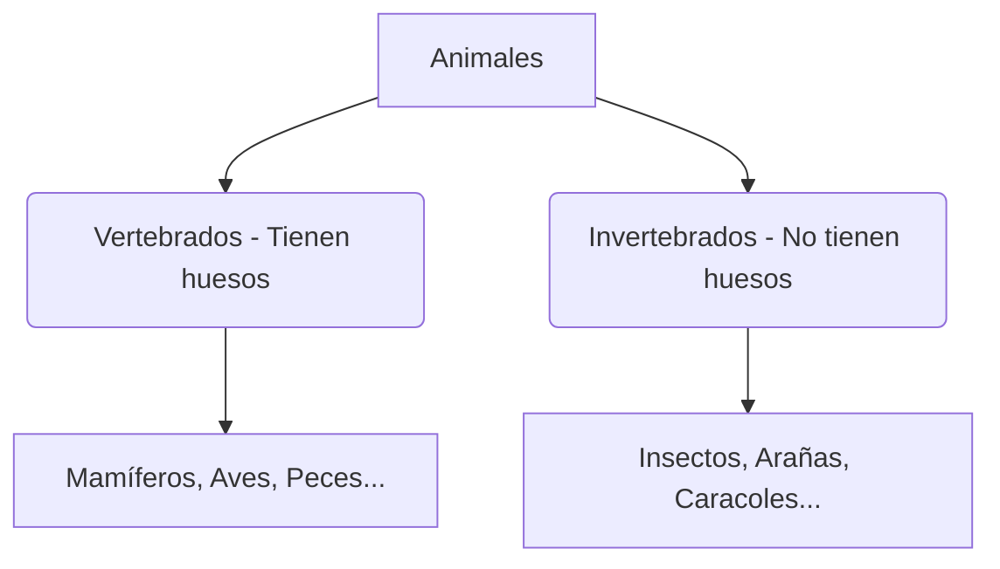

# ¡El Gran Reino Animal!

¿Sabías que hay animales tan pequeños que casi no se ven y otros tan grandes como un edificio? ¡Vamos a descubrir sus secretos!

## ¿Cómo son por dentro?
Podemos clasificar a los animales según si tienen huesos o no:

1. **Animales Vertebrados**: Tienen un esqueleto interno con columna vertebral. Como el perro, el pájaro o nosotros.
2. **Animales Invertebrados**: No tienen huesos. Algunos tienen concha (como el caracol) o caparazón (como el cangrejo), y otros son blanditos (como la lombriz).

### Las funciones vitales
Todos los animales hacen tres cosas muy importantes para vivir:
- **Nutrición**: Comen para tener energía.
- **Relación**: Notan lo que pasa a su alrededor y reaccionan.
- **Reproducción**: Tienen crías para que la especie continúe.

:::tip ¡Ojo al dato!
Los insectos son los animales más numerosos de la Tierra. ¡Hay millones de tipos diferentes!
:::

---
**Sugerencia de imagen**: Un dibujo que compare el esqueleto de un gato (vertebrado) con una hormiga (invertebrado).
