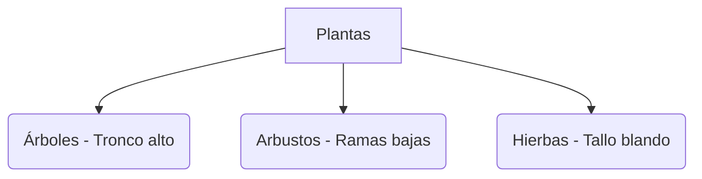

# ¡El Increíble Mundo de las Plantas!

Las plantas son como fábricas naturales que limpian el aire y nos dan comida. ¡Sin ellas no podríamos vivir!

## Tipos de plantas
No todas las plantas son iguales. Según su tamaño y su tronco, las dividimos en:

1. **Árboles**: Tienen un tronco duro y alto (leñoso). Ramifican lejos del suelo.
2. **Arbustos**: Son más bajos que los árboles y sus ramas nacen cerca del suelo.
3. **Hierbas**: Tienen el tallo blandito, fino y verde. Crecen muy rápido.

### El ciclo de la vida
Como todos los seres vivos, las plantas pasan por varias etapas:
1. **Nacen**: De una semilla.
2. **Crecen**: Necesitan agua y luz.
3. **Se reproducen**: Salen flores y nuevas semillas.
4. **Mueren**: Cuando termina su tiempo.

:::tip ¡Sabías que...!
Las plantas fabrican su propio alimento usando la luz del Sol. ¡Es como si cocinaran con rayos de sol!
:::

---
**Sugerencia de imagen**: Un esquema que muestre un roble (árbol), un rosal (arbusto) y una amapola (hierba).
