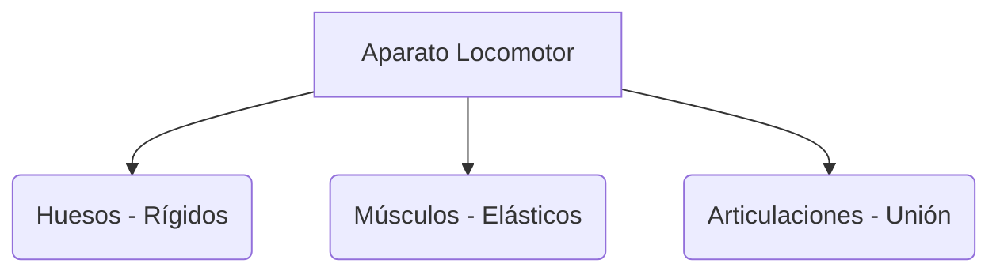

# ¡Nuestra Increíble Máquina: El Cuerpo!

¿Sabes por qué podemos estar de pie o por qué podemos doblar el brazo? ¡Es gracias a nuestro esqueleto y nuestros músculos!

## El Esqueleto y los Huesos
El esqueleto es el conjunto de todos los huesos de nuestro cuerpo. Nos sirve para:
- **Sujetar el cuerpo**: Sin huesos seríamos como gelatina.
- **Proteger órganos**: Las costillas protegen el corazón y el cráneo protege el cerebro.

### Algunos huesos importantes
- **Cráneo**: En la cabeza.
- **Columna vertebral**: En la espalda.
- **Fémur**: El hueso más largo, en la pierna.

## Los Músculos y las Articulaciones
- **Músculos**: Son blandos y elásticos. Nos ayudan a movernos. ¡Tenemos más de 600!
- **Articulaciones**: Son los lugares donde se unen dos huesos y nos permiten doblar el cuerpo, como el **codo**, la **rodilla** o el **tobillo**.

:::tip ¡Cuida tu postura!
Siéntate bien en la silla y no lleves mucho peso en la mochila para que tu espalda esté siempre sana.
:::

---
**Sugerencia de imagen**: Un dibujo de un cuerpo humano dividido en dos: un lado con el esqueleto y el otro con los músculos principales.
