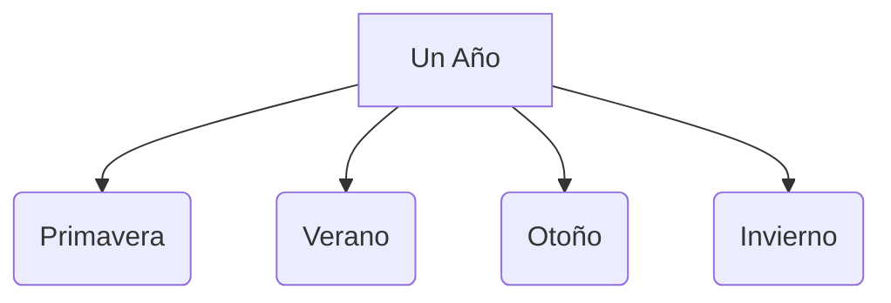

# ¡El Tiempo no se Para!

¿Te has fijado en cómo cambian los árboles o la ropa que usamos? ¡Es porque el tiempo siempre está avanzando!

## El Calendario
Para organizar el tiempo usamos el calendario. Se divide en:
- **Días**: Tienen 24 horas.
- **Semanas**: Tienen 7 días.
- **Meses**: Un año tiene 12 meses.
- **Años**: Un año tiene 365 días.

## Las Estaciones del Año
La Tierra gira alrededor del Sol y eso crea las 4 estaciones:
1. **Primavera**: Salen las flores y hace mejor tiempo.
2. **Verano**: Hace mucho calor y tenemos vacaciones.
3. **Otoño**: Se caen las hojas y empieza a refrescar.
4. **Invierno**: Hace frío y a veces nieva.

## ¿Qué tiempo hace hoy?
Llamamos **tiempo atmosférico** al estado de la atmósfera en un lugar y momento. Puede estar:
- Soleado.
- Nublado.
- Lluvioso.
- Ventoso.

:::tip ¡Ojo al cielo!
Los meteorólogos son los científicos que estudian el tiempo y nos dicen si mañana necesitaremos el paraguas.
:::

---
**Sugerencia de imagen**: Un dibujo de un árbol circular dividido en 4 partes, mostrando su aspecto en cada estación del año.
