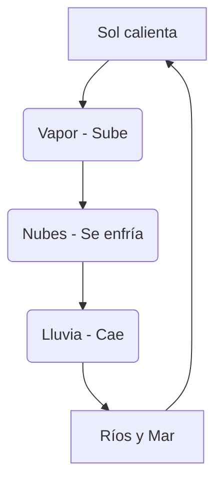

# ¡El Viaje de una Gota de Agua!

¿Sabías que el agua que bebes hoy es la misma que bebían los dinosaurios? ¡El agua nunca para de viajar!

## Los 3 Estados del Agua
El agua puede cambiar de forma según el calor que haga:
1. **Líquida**: La que sale del grifo o está en el río.
2. **Sólida**: Cuando hace mucho frío se convierte en **hielo** o nieve.
3. **Gaseosa**: Cuando el agua se calienta mucho se convierte en **vapor** (como el humo que sale de una sopa caliente).

## El Ciclo del Agua
El agua hace un viaje circular sin fin:
- **Evaporación**: El Sol calienta el agua de los ríos y sube al cielo como vapor.
- **Condensación**: El vapor se enfría y forma las **nubes**.
- **Precipitación**: Cuando las nubes pesan mucho, el agua cae como **lluvia** o nieve.
- **Retorno**: El agua vuelve a los ríos y al mar.

:::tip ¡Agua para todos!
Aunque la Tierra tiene mucha agua, la mayoría es salada. El agua dulce es escasa, ¡cuídala mucho!
:::

---
**Sugerencia de imagen**: Un paisaje con sol, nubes lloviendo y un río que llega al mar, con flechas indicando el ciclo del agua.
