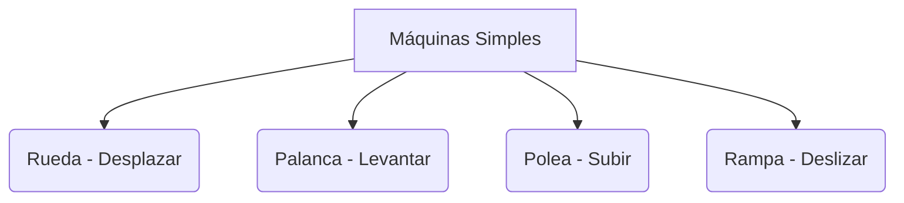

# ¡Inventos que Cambiaron el Mundo!

Desde que el ser humano inventó la rueda, ¡no hemos parado de crear máquinas! Las máquinas nos ayudan a ahorrar tiempo y esfuerzo.

## Máquinas Simples: Las más inteligentes
Aunque parezcan sencillas, son muy potentes. Las más importantes son:
1. **La Rueda**: Nos ayuda a desplazar objetos pesados sin arrastrarlos.
2. **La Palanca**: Sirve para levantar cosas con menos fuerza (como un balancín).
3. **La Polea**: Una rueda con una cuerda que ayuda a subir cubos o pesas.
4. **El Plano Inclinado (Rampa)**: Ayuda a subir objetos rodando o deslizando.

## ¿De dónde sacan la energía?
Las máquinas no funcionan solas. Necesitan energía:
- **Energía Humana**: Cuando pedaleamos una bici.
- **Energía Eléctrica**: Cuando enchufamos la televisión.
- **Combustible**: Cuando echamos gasolina al coche.
- **Energía del Sol o del Viento**: Para calculadoras solares o molinos.

:::tip ¡Inventores famosos!
¿Sabías que un extremeño, Blasco de Garay, fue uno de los pioneros en usar máquinas de vapor en barcos? ¡Tenemos grandes inventores en nuestra tierra!
:::

---
**Sugerencia de imagen**: Un dibujo que muestre a un niño levantando una caja pesada usando una palanca y otro niño usando una polea para subir un cubo.
