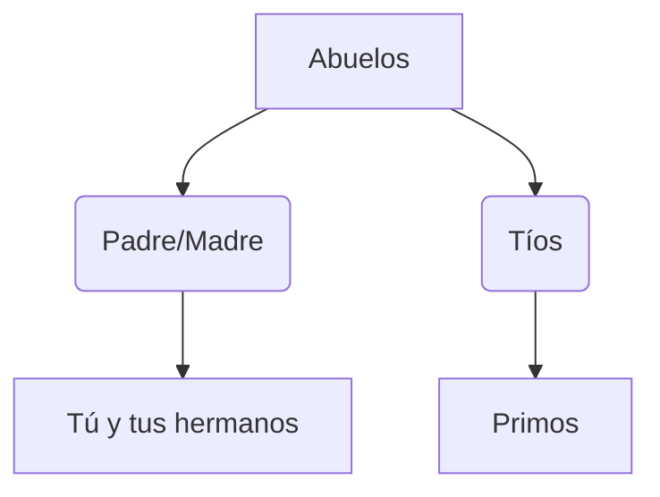

# ¡Mi Familia es mi Tesoro!

La familia es el grupo de personas que viven juntas y se quieren. ¡Hay tantas familias como niños en el mundo!

## El Árbol de la Familia (Parentesco)
Para entender quién es quién en nuestra familia, usamos el parentesco:
- **Abuelos**: Los padres de nuestros padres.
- **Tíos**: Los hermanos de nuestros padres.
- **Primos**: Los hijos de nuestros tíos.

## Convivencia y Corresponsabilidad
Vivir en familia es como jugar en un equipo. Todos debemos ayudar para que la casa funcione bien:
- **Respeto**: Escuchar y hablar con cariño.
- **Corresponsabilidad**: Repartir las tareas (limpiar, cocinar, cuidar a los animales) entre todos, sin importar si somos hombres o mujeres.

:::tip ¡En equipo es mejor!
Si todos ayudamos un poquito en casa, ¡tendremos más tiempo para jugar juntos después!
:::

---
**Sugerencia de imagen**: Una ilustración de una familia diversa (unida por el cariño) colaborando en las tareas del hogar con alegría.
