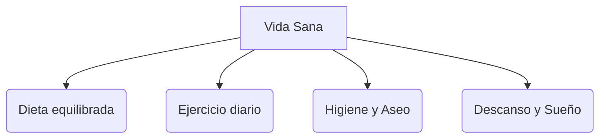

# ¡Cuerpo Sano, Mente Feliz!

Estar sano significa sentirse bien con nuestro cuerpo y con nuestras emociones. ¡Es como tener un motor que siempre funciona genial!

## Los 4 Pilares de la Salud
Para estar a tope, debemos cuidar estos cuatro puntos:

1. **Alimentación equilibrada**: Comer de todo, especialmente frutas y verduras. La pirámide alimenticia nos ayuda a saber qué comer más.
2. **Ejercicio físico**: Jugar, correr y saltar fortalece nuestros músculos y el corazón.
3. **Higiene personal**: Lavarse las manos, ducharse y cepillarse los dientes después de cada comida.
4. **Descanso**: Dormir unas 10 horas cada noche para que nuestro cerebro descanse.

:::tip ¡A lavarse los dientes!
Debemos cepillarnos los dientes durante 2 minutos. ¡Es el tiempo que tarda en sonar una de tus canciones favoritas!
:::

---
**Sugerencia de imagen**: Una pirámide de alimentos colorida y un niño haciendo deporte con una botella de agua al lado.
