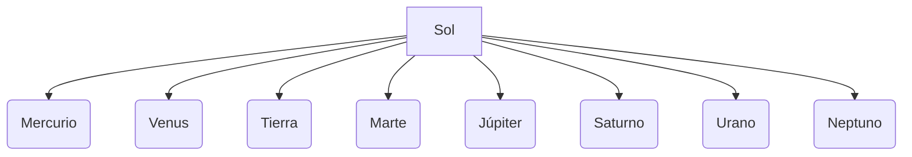

# ¡Un Viaje a las Estrellas!

¿Alguna vez te has preguntado qué hay más allá de las nubes cuando miras al cielo por la noche? ¡Estamos en un lugar inmenso llamado Universo!

## El Sistema Solar
Nuestra "casa" en el espacio es el Sistema Solar. Está formado por una gran estrella, el **Sol**, y ocho planetas que giran a su alrededor.

### Los Planetas
Los planetas son astros que no tienen luz propia. Podemos dividirlos en dos grupos:
1. **Planetas Rocosos**: Son pequeños y de piedra, como **Mercurio, Venus, Tierra** y **Marte**.
2. **Planetas Gaseosos**: Son gigantes y de gas, como **Júpiter, Saturno, Urano** y **Neptuno**.

## Otros astros del espacio
- **Estrellas**: Bolas de fuego gigantes que dan luz y calor (como el Sol).
- **Satélites**: Giran alrededor de los planetas. El nuestro es la **Luna**.
- **Cometas y Asteroides**: Rocas espaciales que viajan por el universo.

:::tip ¡Ojo al dato!
La luz del Sol tarda unos 8 minutos en llegar a la Tierra. ¡Estamos viendo luz que salió del Sol hace un rato!
:::

---
**Sugerencia de imagen**: Una infografía del Sistema Solar con el Sol a la izquierda y los planetas ordenados por distancia, destacando los anillos de Saturno.
