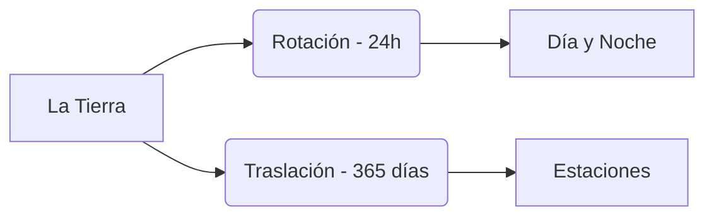

# La Tierra: Un Planeta en Movimiento

¿Has notado que nunca estamos quietos? Aunque no lo sientas, la Tierra siempre se está moviendo por el espacio.

## Los Movimientos de la Tierra
La Tierra realiza dos movimientos muy importantes al mismo tiempo:

1. **Rotación**: La Tierra gira sobre sí misma, como una peonza. 
   - **Tarda**: 24 horas (1 día).
   - **Produce**: El día y la noche.
2. **Traslación**: La Tierra gira alrededor del Sol.
   - **Tarda**: 365 días (1 año).
   - **Produce**: Las estaciones del año.

## Las Capas de la Tierra
Si pudiéramos cortar la Tierra como una naranja, veríamos que tiene capas:
- **Atmósfera**: La capa de aire que nos rodea.
- **Hidrosfera**: Toda el agua del planeta (mares, ríos, hielo).
- **Geosfera**: La parte de roca y metal. Se divide en **Corteza** (donde pisamos), **Manto** y **Núcleo** (en el centro, ¡está muy caliente!).

:::tip ¡Curiosidad!
¡El núcleo de la Tierra está tan caliente como la superficie del Sol!
:::

---
**Sugerencia de imagen**: Un dibujo de la Tierra cortada por la mitad mostrando la corteza, el manto y el núcleo con diferentes colores (marrón, naranja, rojo brillante).
