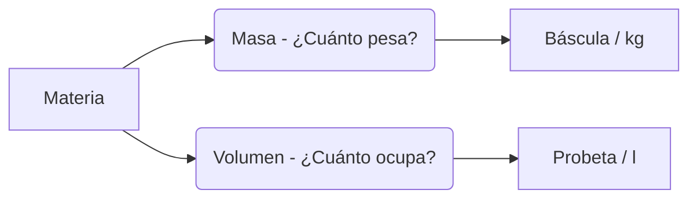

# ¿De qué están hechas las cosas?

Todo lo que ves, tocas y hueles está hecho de **materia**. ¡Desde el aire invisible hasta las rocas más duras!

## Las Propiedades de la Materia
Toda la materia tiene dos propiedades que podemos medir:

1. **La Masa**: Es la cantidad de materia que tiene un objeto. Se mide con una **balanza** o báscula en **kilogramos (kg)** o gramos (g).
2. **El Volumen**: Es el espacio que ocupa un objeto. Se mide con recipientes graduados (como probetas) en **litros (l)** o mililitros (ml).

## Los Estados de la Materia
La materia puede presentarse en tres estados:
- **Sólido**: Tienen una forma fija (como una piedra o un lápiz).
- **Líquido**: Toman la forma del recipiente que los contiene (como el agua o el zumo).
- **Gaseoso**: No tienen forma ni volumen fijo, se expanden por todo el espacio (como el aire o el vapor).

:::tip ¡Ojo al dato!
¡El aire tiene masa! Aunque no lo parezca, una pelota inflada pesa un poquito más que una pelota vacía.
:::

---
**Sugerencia de imagen**: Una comparación visual: una báscula pesando una manzana (masa) y un vaso medidor con agua (volumen).
