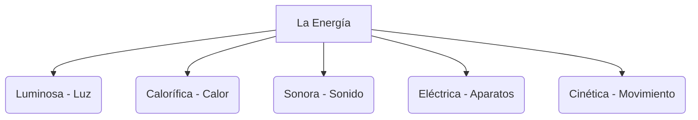

# ¡La Energía mueve el Mundo!

¿Te has preguntado alguna vez por qué se enciende la luz, por qué se mueve un coche o por qué el sol calienta? La respuesta es siempre la misma: **la energía**.

## ¿Qué es la energía?
La energía es la capacidad de producir cambios. Gracias a ella las cosas se mueven, se calientan, se iluminan o hacen ruido.

## Tipos de Energía
Existen varios tipos de energía a nuestro alrededor:
- **Energía luminosa**: La que nos da la luz (el Sol, una bombilla).
- **Energía calorífica**: La que produce calor (el fuego, un radiador).
- **Energía sonora**: La que produce sonido (un tambor, la voz).
- **Energía eléctrica**: La que viaja por los cables y hace funcionar los aparatos.
- **Energía del movimiento (cinética)**: La que tienen los objetos cuando se mueven (un balón, el viento).

## Fuentes de Energía
Las fuentes de energía pueden ser de dos tipos:
1. **Renovables** ♻️: No se agotan y no contaminan. Ejemplos: el Sol, el viento y el agua de los ríos.
2. **No renovables** ⛽: Se pueden agotar y contaminan. Ejemplos: el petróleo, el carbón y el gas natural.

:::tip ¡Ojo al dato!
Una hora de luz solar sobre la Tierra bastaría para dar electricidad a todo el planeta durante un año entero. ¡El Sol es una fuente increíble de energía!
:::

---
**Sugerencia de imagen**: Un paisaje con molinos de viento, paneles solares y una presa hidroeléctrica representando las energías renovables.
