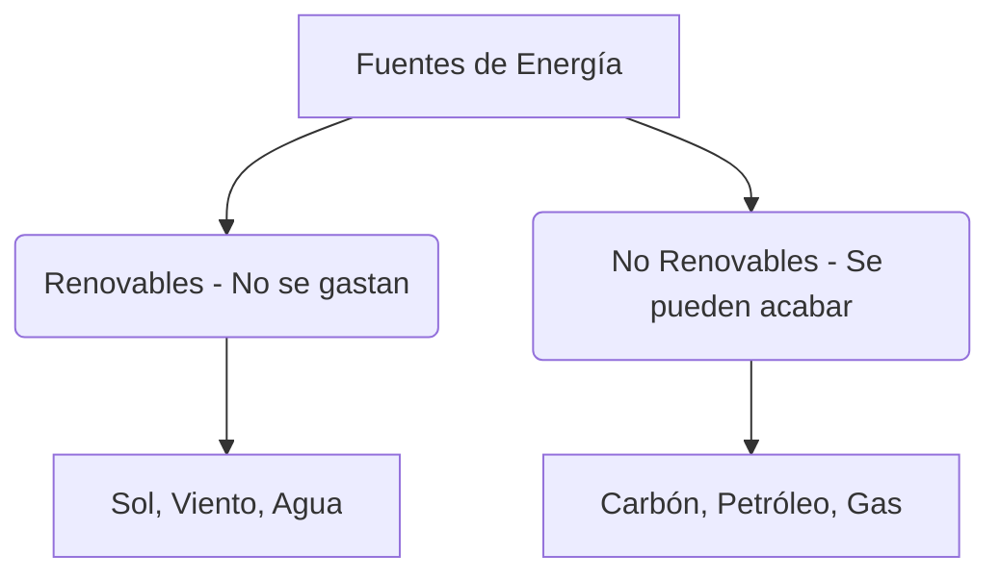

# ¿Qué hace que todo se mueva?

¿Alguna vez te has preguntado cómo funciona tu consola de videojuegos, por qué se calienta la sopa o cómo hace una planta para crecer? ¡La respuesta a todos estos misterios es la **energía**!

La energía no tiene forma, no se puede tocar ni pesar, pero está en todas partes y es la responsable de **todos los cambios** que ocurren en la naturaleza.

---

## Las Formas de la Energía

La energía se disfraza de muchas maneras diferentes. Aquí tienes las más comunes:

* **Energía Luminosa**: Es la que nos da luz. La luz del **Sol**, una bombilla o una linterna.
* **Energía Térmica (Calor)**: Es la que da calor. Por ejemplo, el fuego de una hoguera o un radiador.
* **Energía Mecánica**: Es la que tienen los objetos en movimiento, como el viento, el agua de un río o tú mismo cuando corres.
* **Energía Eléctrica**: La que viaja por los cables para hacer funcionar los electrodomésticos.
* **Energía Química**: Está guardada dentro de los alimentos (¡nos da energía a las personas!) y de las pilas o la gasolina.
* **Energía Sonora**: Es la que produce el sonido cuando los objetos vibran, como la música o un grito.

---

## ¿De dónde sacamos la energía? (Las Fuentes)

La energía que utilizamos proviene de la naturaleza. Existen dos tipos de fuentes de energía:

### 1. Fuentes Renovables (¡Las amigas del planeta!)
Son fuentes limpias e inagotables, nunca se acaban:
* **El Sol**: Nos da luz y calor (energía solar).
* **El Viento**: Mueve las aspas de los aerogeneradores (energía eólica).
* **El Agua**: Mueve turbinas en los ríos para hacer electricidad (energía hidráulica).

### 2. Fuentes No Renovables (¡Cuidado, se agotan!)
Tardan millones de años en formarse y, si las usamos mucho, se acabarán algún día:
* **El Carbón y el Petróleo**: Rocas y líquidos negros bajo tierra de donde sacamos gasolina y calor.
* **El Gas Natural**: Un gas bajo tierra que usamos para cocinar o calentar.

:::tip ¡Ojo al dato!
La energía no se crea de la nada ni se destruye, ¡solo **se transforma**! Por ejemplo, la energía eléctrica que llega a una bombilla se transforma en energía luminosa y un poquito de térmica (calor).
:::

---
**Sugerencia de imagen**: Un dibujo limpio y colorido de un campo con un sol brillante, unos molinos de viento modernos de color blanco girando en una colina, y un pequeño río con agua fluyendo alegremente.
