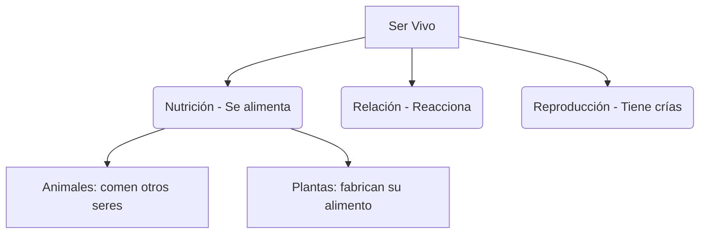

# ¡El Maravilloso Mundo de los Seres Vivos!

Mira a tu alrededor: el perro del vecino, el árbol del patio, las flores del jardín… todos tienen algo en común. ¡Están vivos!

## ¿Qué es un ser vivo?
Los seres vivos son todos aquellos que **nacen, crecen, se alimentan, se reproducen y mueren**. A este recorrido lo llamamos **ciclo vital**.

## Las Tres Funciones Vitales
Todo ser vivo realiza tres funciones imprescindibles:
1. **Nutrición**: Obtener alimentos para conseguir la energía que necesitan.
2. **Relación**: Percibir lo que ocurre a su alrededor y reaccionar (huir del peligro, buscar la luz…).
3. **Reproducción**: Crear nuevos seres vivos parecidos a ellos.

## Grandes Grupos de Seres Vivos
Podemos clasificar los seres vivos en tres grandes reinos:
- **Animales** 🐾: Se desplazan y se alimentan de otros seres vivos. Pueden ser vertebrados o invertebrados.
- **Plantas** 🌿: Fabrican su propio alimento usando la luz del Sol (fotosíntesis). No se desplazan.
- **Hongos** 🍄: No son plantas ni animales. No fabrican su alimento, sino que lo obtienen de materia en descomposición.

:::tip ¡Ojo al dato!
¡El ser vivo más grande del mundo es un hongo! Se llama *Armillaria* y vive bajo tierra en Oregón (EE. UU.), ocupando un espacio equivalente a 1.600 campos de fútbol.
:::

---
**Sugerencia de imagen**: Tres columnas con ejemplos de animales, plantas y hongos en sus hábitats naturales.
