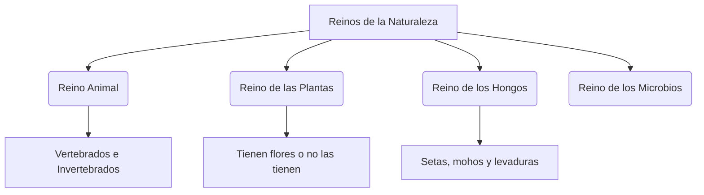

# ¿Qué es la vida?

¿Qué tienen en común un majestuoso lince ibérico, una encina centenaria de Extremadura y el champiñón que comes en la pizza? ¡Todos ellos son **seres vivos**! 

A diferencia de las rocas o el agua, los seres vivos estamos formados por células y realizamos tres actividades increíbles a lo largo de nuestra vida.

---

## Las Tres Funciones Vitales

Todos los seres vivos realizamos tres tareas obligatorias para sobrevivir:

1. **La Nutrición**: Conseguimos energía a través del alimento. Las plantas fabrican su propio alimento con el Sol y el agua, mientras que los animales deben comer otros seres vivos.
2. **La Relación**: Percibimos lo que pasa a nuestro alrededor y reaccionamos. Por ejemplo, si un conejo ve un lobo, ¡sale corriendo!
3. **La Reproducción**: Tenemos hijos o descendientes parecidos a nosotros para que la especie continúe (como las semillas de una planta o los cachorros de un perro).

---

## ¿Cómo clasificamos los Seres Vivos?

Hay tantos millones de seres vivos en el planeta que los científicos los organizan en varios grupos llamados **Reinos**:

### 1. El Reino Animal
Los animales se desplazan y se alimentan de otros seres vivos. Los dividimos en dos grandes grupos:
* **Vertebrados (tienen esqueleto interno y columna vertebral)**: Como los mamíferos (perros, delfines), las aves (cigüeñas), los reptiles (lagartijas), los anfibios (ranas) y los peces.
* **Invertebrados (no tienen huesos ni columna vertebral)**: Son la mayoría de los animales de la Tierra. Como los insectos (abejas, mariposas), moluscos (caracoles) y gusanos.

### 2. El Reino de las Plantas
Las plantas no se mueven del suelo y fabrican su propia comida. Son vitales porque producen el oxígeno que respiramos.

### 3. El Reino de los Hongos
No son plantas ni animales. No se mueven pero se alimentan de restos de otros seres vivos del suelo (como las setas o el moho del pan).

:::tip ¡Ojo al dato!
Las abejas son animales invertebrados (insectos) pero son unas de las criaturas más importantes de la Tierra. ¡Gracias a que transportan el polen de flor en flor, las plantas pueden reproducirse y darnos frutos!
:::

---
**Sugerencia de imagen**: Una ilustración infantil y colorida que muestre una división en cuadrantes: un animal vertebrado (lince ibérico), un animal invertebrado (abeja), una planta con flores, y un hongo (seta en el bosque).
