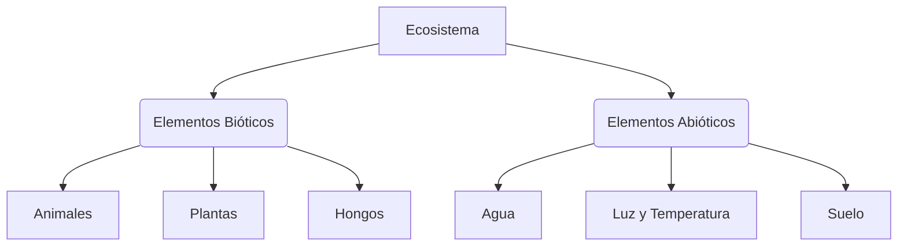

# ¡Descubrimos los Ecosistemas!

Imagina un bosque: los árboles, los pájaros, los insectos, el agua del río, la luz del sol… Todo está conectado. Eso es un **ecosistema**.

## ¿Qué es un ecosistema?
Un ecosistema es el conjunto formado por los **seres vivos** (plantas, animales, hongos) y el **medio físico** (agua, suelo, clima) de un lugar, y las relaciones que se establecen entre ellos.

## Los Elementos del Ecosistema
Cada ecosistema tiene dos partes:
1. **Elementos bióticos** (con vida): Todos los seres vivos que habitan en él: árboles, insectos, aves, peces…
2. **Elementos abióticos** (sin vida): Las condiciones del medio: el agua, la luz, la temperatura, el tipo de suelo…

## Tipos de Ecosistemas
- **Terrestres** 🌲: Bosques, praderas, desiertos, montañas.
- **Acuáticos** 🌊: Mares, océanos, ríos, lagos y charcas.
- **Mixtos** 🏖️: Zonas donde se mezclan agua y tierra, como las playas o las marismas.

:::tip ¡Ojo al dato!
Todos los seres vivos de un ecosistema dependen unos de otros. Si desaparecen las abejas, muchas plantas no podrían reproducirse y los animales que comen esas plantas también sufrirían. ¡Todo está conectado!
:::

---
**Sugerencia de imagen**: Un ecosistema de bosque con etiquetas señalando animales, plantas, agua y luz solar.
