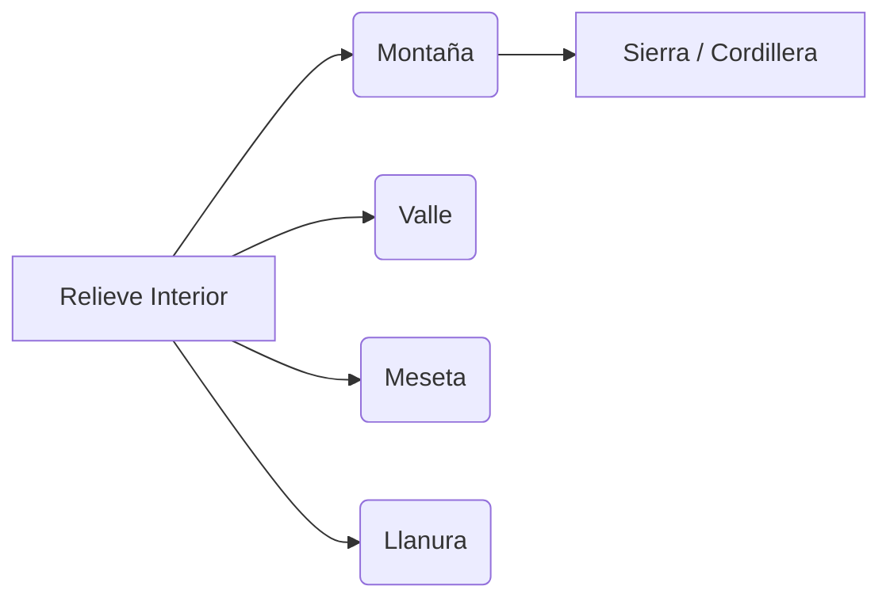

# ¡Las Formas de la Tierra!

Si miras por la ventana del coche cuando viajas, verás que el paisaje cambia mucho: a veces hay montañas altísimas, otras veces campos planos que no se acaban nunca. Todas esas formas se llaman **relieve**.

## ¿Qué es el relieve?
El relieve es el conjunto de formas que tiene la superficie de la Tierra. Puede ser alto o bajo, plano o con picos.

## Formas del Relieve Interior
Lejos de la costa encontramos:
- **Montaña** 🏔️: Elevación alta y pronunciada del terreno. Varias montañas juntas forman una **sierra** o **cordillera**.
- **Valle**: Zona baja y alargada entre dos montañas, por donde suele correr un río.
- **Meseta**: Terreno elevado pero plano en su parte superior, como una mesa gigante.
- **Llanura**: Terreno extenso y plano a baja altura, ideal para la agricultura.

## Formas del Relieve Costero
Junto al mar encontramos:
- **Playa** 🏖️: Zona llana de arena o piedras junto al mar.
- **Acantilado**: Roca alta y vertical que cae al mar.
- **Cabo**: Trozo de tierra que se mete en el mar.
- **Golfo y bahía**: Entradas del mar en la tierra.

:::tip ¡Ojo al dato!
La montaña más alta de España es el Teide, en Tenerife (Canarias), con 3.718 metros. ¡Pero la más alta de la Península es el Mulhacén, en Granada, con 3.479 metros!
:::

---
**Sugerencia de imagen**: Un corte transversal del terreno mostrando montaña, valle, meseta y llanura con etiquetas.
