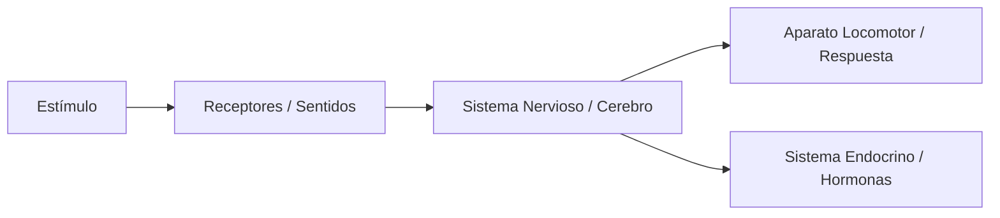

# La Función de Relación: Conectados con el Mundo

Como seres vivos, tenemos la capacidad de percibir lo que ocurre a nuestro alrededor y reaccionar de forma adecuada. Esto es vital para nuestra supervivencia.

## ¿Cómo nos relacionamos?
La función de relación implica tres procesos fundamentales que trabajan en cadena:

1. **Captación de información**: Los **órganos de los sentidos** (receptores) detectan estímulos del exterior o del interior.
2. **Análisis y procesamiento**: El **Sistema Nervioso** (el cerebro) recibe la información, la interpreta y decide una respuesta.
3. **Ejecución de la respuesta**: El **aparato locomotor** (músculos y huesos) o el **sistema endocrino** ejecutan la orden.

## El Sistema Nervioso Central
El cerebro es el "centro de control". Se divide en varias partes con funciones específicas:
- **Cerebro**: Controla actos voluntarios y la memoria.
- **Cerebelo**: Coordina el equilibrio y los movimientos.
- **Bulbo raquídeo**: Controla funciones involuntarias (latidos del corazón, respiración).

:::info Debate en clase
¿Crees que un deportista de élite tiene más desarrollado el cerebelo o el cerebro? Justifica tu respuesta basándote en la coordinación de movimientos.
:::

---
**Sugerencia de imagen**: Un diagrama anatómico realista del sistema nervioso humano, destacando el encéfalo y la médula espinal con etiquetas técnicas.
